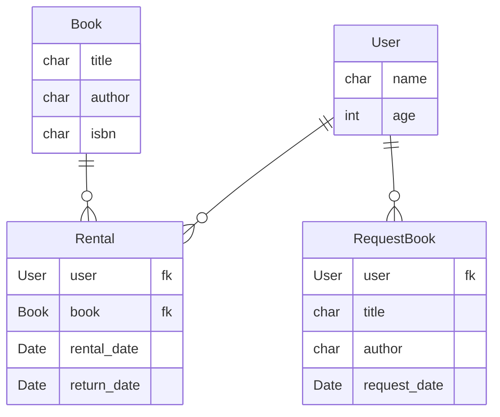

# OOP2 第 10 回レポート

学籍番号: k24000
 
名前: 愛工 太郎

## データ登録アプリケーションにて登録するデータ

```mermaid
erDiagram

User{
	char name
	int age
}
Book{
	char title
	char author
	char isbn
}
Rental{
	User user "fk"
	Book book "fk"
	Date rental_date
	Date return_date
}
RequestBook{
	User user "fk"
	char title
	char author
	Date request_date
}

	User ||--o{ Rental : ""
	User ||--o{ RequestBook : ""
	Book ||--o{ Rental : ""
```

## 自分が担当したデータや画面
